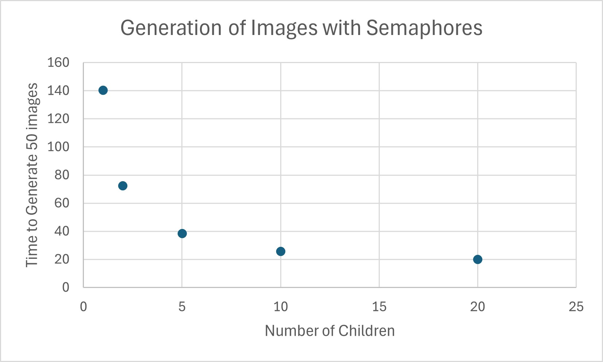
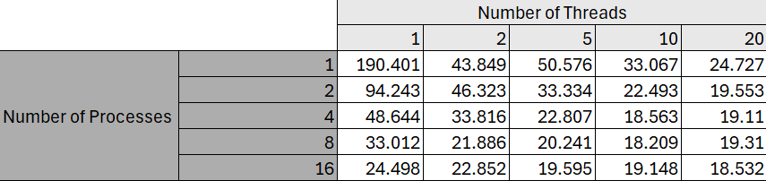

# System Programming Lab 11 Multiprocessing

[Watch the Mandelbrot movie](./mandel.mp4)

## Overview

This program generates a series of Mandelbrot images using multiple multi-processesing to speed up the task. The program allows the user to specify various parameters via command-line arguments, such as:

- The number of child processes (`-n`)
- Image dimensions (`-W` for width, `-H` for height)
- The number of frames (`-f`)
- Maximum iterations (`-m`)
- Output file prefix (`-p`)
- Option to use semaphores for process management (`-S`)
- Option to use threads (`-t`))

The program generates a series of 50 frames, with each frame having slightly smaller scales to create an animation effect. The images are saved in JPEG format with a user-defined prefix.

Two options for managing child processes are provided:
1. **Using child processes**: The program forks child processes to generate individual images concurrently.

2. **Using semaphores**: If the `-S` option is specified, a semaphore is used to manage and synchronize the child processes, ensuring they don't overwhelm system resources.

#### Compiling the program
A makefile is created for this assignment so use:
```bash
make
```

## Graph of Runtime Results

The following graph shows the runtime results for different numbers of child processes used to generate Mandelbrot frames. The execution time was measured using the `time` command on Linux.



## Discussion of Results

The graph above shows the runtime of the Mandelbrot image generation program for varying numbers of child processes. The performance improves as the number of child processes increases from 1 to 5, which is expected since the workload can be parallelized effectively across multiple processes. However, as the number of processes increases beyond 10, the performance improvement starts to diminish. This can be attributed to the overhead of managing a larger number of processes and the limited resources of the system such as CPU and memory. While using multiple processes does speed up the operation initially, there is a diminishing return as the number of processes exceeds the number of available CPU cores.

## Runtime Comparison Table

The following table shows the how differing number of threads and processes impact the time for the generation for 50 Mandelbrot frames. The execution time was measured using the `time` command on Linux.



## Discussion of Results

The table above shows the runtime of the Mandelbrot image generation program for varying numbers of child processes and threads. The most impactful to the time seems to be the number of processes. In the data it shows that the processes increasing cause the time to decrease at a faster rate. The sweet spot where runtime was optimised was at around 10 threads and 8 processes, it seems adding more processes or threads doesn't add any improvement to the time.
